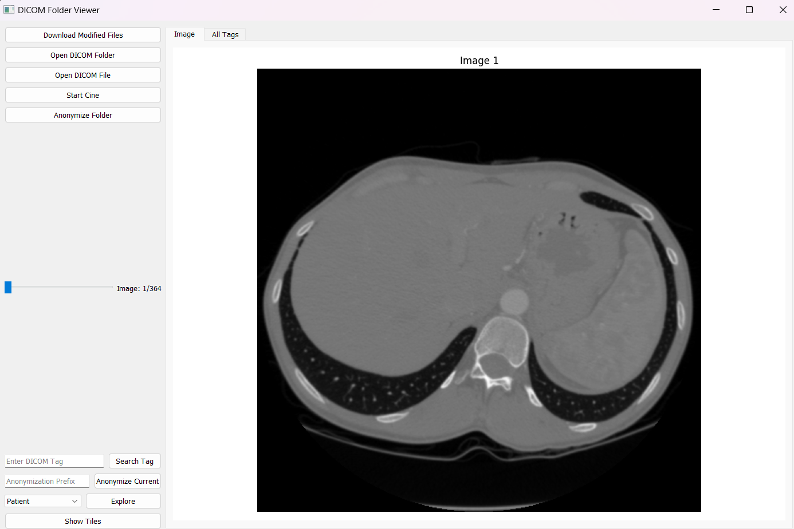

# DICOM Viewer Application

This project is a **DICOM Viewer Application** built using Python and PyQt5. It provides a graphical interface to load, view, explore, and manage DICOM images efficiently.

## Features

- **Load and Display**: Open individual DICOM files or an entire folder of DICOM files.
- **Image Exploration**:
  - View pixel data and metadata tags for DICOM files.
  - Support for multi-frame DICOM files.
- **Anonymization**:
  - Anonymize sensitive patient information in DICOM files.
  - Export anonymized files with a custom prefix.
- **Advanced Viewing**:
  - Zoom and pan functionality.
  - Cine mode for sequential image playback.
  - Thumbnail grid view for quickly navigating images.
- **Metadata Search**:
  - Search for specific DICOM tags and values.

## Requirements

Ensure the following dependencies are installed:

- Python 3.7+
- PyQt5
- Pydicom
- Matplotlib
- Faker

Install these dependencies using pip:

```bash
pip install PyQt5 pydicom matplotlib faker
```

## Usage

1. Clone or download the repository.

2. Run the application:

   ```bash
   python <filename>.py
   ```

3. Use the GUI to:
   - Open a folder containing DICOM files.
   - View images and explore their metadata.
   - Anonymize and save modified DICOM files.

## Code Overview

### Key Components

1. **Main Window (`DicomFolderViewer`)**
   - Handles the core functionality, including file loading, image display, and tag exploration.
   - Integrates with multiple dialogs for additional operations.

2. **Dialogs**
   - **Tiles Dialog**: Displays a grid of thumbnails for all loaded DICOM files.
   - **Explore Dialog**: Allows detailed exploration of specific metadata tags.

3. **DICOM Folder Handler (`DicomFolderHandler`)**
   - Manages DICOM file loading, metadata extraction, and anonymization.

4. **Cine Mode**
   - Enables sequential playback for multi-frame DICOM files.

## File Structure

```plaintext
.
├── <filename>.py         # Main application code
```

## Screenshots

1. **Main Interface**  
   

2. **Metadata Exploration**  
   


## Customization

- Update functionality by extending `DicomFolderHandler` or overriding methods in `DicomFolderViewer`.
- Add new tools or buttons to the control panel for additional DICOM operations.

## License

This project is open-source and free to use or modify.

